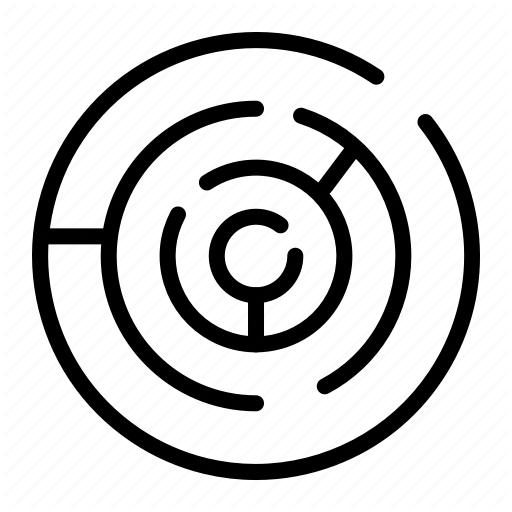

  

<h1 align="center">Mazesome</h1>

  
  
  
  

## Contents

- [Description](#-description)
- [Creators](#-creators)
- [License](#-license)

## 📋 Description

Simple and native api that allows you to lock the mouse to keep it controlled in an area and be able to move it in any direction and to infinity.

## 👏 Creator

### Alejandro Torres

- <https://codepen.io/aresigner/>
- <https://github.com/aresigner/>

## 📄 License

Code and documentation copyright 2020 the [Ceres Author](https://github.com/aresigner/). Code released under the [MIT License](https://github.com/twbs/bootstrap/blob/master/LICENSE). Docs released under [Creative Commons](https://github.com/twbs/bootstrap/blob/master/docs/LICENSE).
